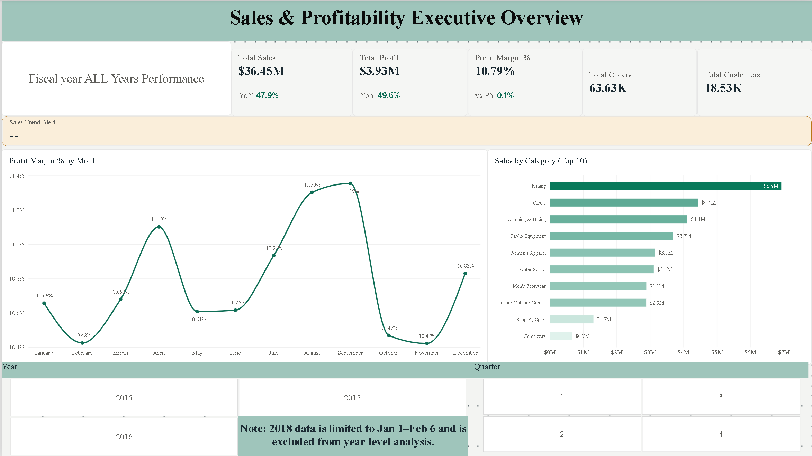
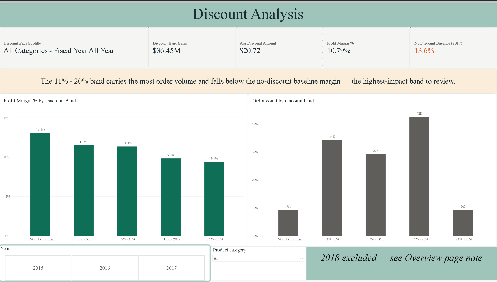
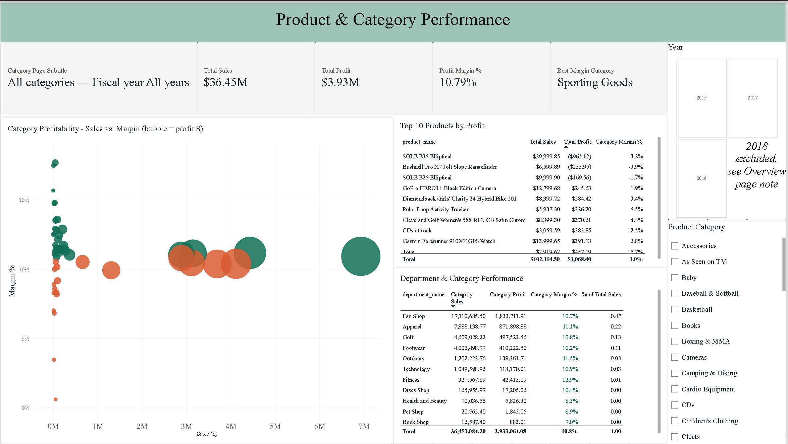

# Sales & Profitability-Analysis
This is an end-to-end business intelligence project analyzing sales performance, discount impact, and product/category profitability using a DataCo Supply Chain Dataset.
I built a fully modeled Power BI report.

---
## Project Overview
This project takes a supply chain transactions dataset and turns it into a decision-ready analytics product: 
a governed SQL data warehouse (bronze → silver → gold), a star-schema semantic model, a DAX measures library, 
and a 3-page Power BI report covering executive performance, discount profitability, and product/category performance.
The goal was not to produce charts, but to answer specific business questions with numbers that can be trusted, 
which meant fixing real data-quality issues in the source pipeline before any visual was built.

---
## Business Problem

Sales growth alone doesn't tell a business whether it's healthy. A company can grow revenue while quietly losing margin to poorly-targeted discounting, 
or while its "best-selling" products are actually its least profitable ones. Leadership needs to see the full chain, 
**Revenue → Profitability → Performance → Business Opportunities → Decision Making**, not just a sales total.

This project was built to answer three specific management questions:
1. Is the business becoming more profitable, or are the sales increasing while profitability is getting worse?
2. Are the discounts we're offering actually helping the business make money, or are we sacrificing too much profit just to sell more products?
3. Which products and categories are genuinely driving profit, as opposed to which ones simply generate the most transactions?


---
## Project Objectives

- Build a reliable, auditable data pipeline from raw transactional data to a reporting-ready model
- Design a star-schema semantic model suitable for scalable DAX calculations
- Quantify the true profit impact of discounting, band by band
- Identify which products and categories drive real profit contribution, not just sales volume
- Identify and transparently communicate data-quality issues and limitations that may affect the analysis.

---
## Key Business Questions

- What are total sales, profit, and profit margin, and how are they trending year over year?
- Does profit margin decline as discount rate increases, and by how much?
- Which discount band is used most heavily, and is that band actually profitable relative to charging full price?
- Which products contribute the most profit (not just the most sales)?
- Which categories/departments are outperforming or underperforming the company's average margin?

---
## Dataset

Supply chain order-line-level transactional data, including order dates, shipping dates, customer, product, category/department, discount rate and amount, sales, and profit (`benefit_per_order`) per order line.

**Confirmed data limitation:** the dataset's final year (2018) contains only 37 days of records (`2018-01-01` to `2018-02-06`), confirmed directly against the date dimension. This year is excluded from all year-level comparisons in the report, since it cannot function as a comparable period against full 365/366-day years. It remains part of the underlying model but is not selectable as a standalone year.

---
## Tools & Technologies

| Category | Tools |
|---|---|
| Database | PostgreSQL |
| BI & Reporting | Power BI Desktop |
| Calculation Engine | DAX |
| Data Prep | Power Query, SQL |
| Version Control / Portfolio | GitHub |

## Data Preparation & Cleaning

Data was processed through a three-layer pipeline in PostgreSQL:

**Bronze (raw):** Source CSV loaded as-is, with all columns stored as `TEXT` to preserve the original values.

**Silver (cleaned & typed):**
- Corrected data types for dates, integers, and numeric fields
- Applied `TRIM()` to remove unnecessary whitespace
- Applied `INITCAP()` to standardize names and city capitalization
- Identified and removed a data-corruption step that incorrectly replaced the `"Payment"` transaction type with a placeholder value

**Gold (star schema):**
- Built `dim_date`, `dim_customer`, `dim_product`, `dim_location`, `dim_shipping`, and `fact_order_items`
- Built `dim_date` using both `order_date` and `shipping_date` to ensure complete date coverage
- Deduplicated `dim_location` using business keys to prevent fragmented regional reporting
- Corrected the ETL execution order so foreign keys were populated before building the fact table

**Reporting views:** Created four reporting views:
- `vw_discount_impact`
- `vw_profit_by_category`
- `vw_profit_by_region`
- `vw_customer_segments`

`vw_discount_impact` also includes ordered discount bands using a `discount_band_sort` field for correct Power BI ordering.

---

## Data Modeling

The Power BI semantic model uses a **star schema** built around four objects:

- `dim_date`
- `dim_product`
- `vw_discount_impact`
- `vw_profit_by_category`

**Relationships:**
- `dim_date[date_id]` → `vw_discount_impact[order_date_id]`
- `dim_date[date_id]` → `vw_profit_by_category[order_date_id]`
- `dim_product[product_id]` → `vw_discount_impact[product_id]`
- `dim_product[product_id]` → `vw_profit_by_category[product_id]`

All relationships are active, one-to-many, and single-directional.

`dim_date` is marked as the official Power BI Date Table.

Redundant product and category fields from the reporting views are hidden so `dim_product` remains the single source of truth for filtering.

---

## Data Analysis

Analysis was structured around three areas:

1. **Time-based performance** — Sales, profit, and margin trends with year-over-year comparisons
2. **Discount-band performance** — Profit margin and order volume across discount levels compared with the no-discount baseline
3. **Product/category performance** — Profit contribution and margin compared with the company-wide average

---

## Key Performance Indicators (KPIs)

**Fiscal Year 2017 — Most Recent Complete Year**

| KPI | Value |
|---|---:|
| Total Sales | $11.81M |
| Total Profit | $1.30M |
| Profit Margin % | 11.04% |
| Total Orders | 21.87K |
| Total Customers | 15.16K |
| No-Discount Baseline Margin | 13.6% |

**All-time totals (2015–2018):**

Sales: **$36.78M** · Profit: **$3.97M** · Margin: **10.78%** · Orders: **65.75K** · Customers: **20.65K**

---

## Dashboard

The report contains three Power BI pages:
<p align="center">
  
</p>

**Page 1 — Executive Overview**

Shows Sales, Profit, Profit Margin %, Orders, Customers, monthly margin trends, and Sales by Category. Includes year-over-year comparisons, Year/Quarter slicers, and a margin-decline alert.

2018 is deliberately excluded from year-level analysis because it contains only 37 days of data.

 <p align="center">
  
</p>

**Page 2 — Discount Analysis**

Shows discounted sales, average discount, profit margin, and the no-discount baseline. Includes margin and order volume by discount band, dynamic filtering, and an alert identifying the highest-volume discount band.

 <p align="center">
  
</p>

**Page 3 — Product & Category Performance**

Compares category sales, margins, and profit contribution. Includes a Top 10 Products table ranked by actual profit and margin, with conditional formatting based on performance against the company average.

---

## Key Insights

- **Discounting reduces profitability across every analyzed tier.** All discount bands produced margins below the 13.6% no-discount baseline.
- **The 11%–20% discount band has the highest order volume**, making it the most important discount tier to review.
- **Revenue and profitability do not always move together**, highlighting the importance of evaluating margin alongside sales.
- **2018 was excluded from year-over-year analysis** because the dataset contains only 37 days of data for that year.

---

## Business Recommendations

- **Review the 11%–20% discount band** due to its combination of high usage and lower profitability.
- **Compare additional sales volume against margin sacrificed** before expanding discount programs.
- **Prioritize high-profit and above-average-margin products/categories** for continued investment.
- **Evaluate below-average-margin categories in context**, considering their contribution to overall sales and profit.

---

## Project Structure

```text
Sales-Profitability-Analysis/
│
├── SQL/
│   ├── 01_bronze_layer.sql
│   ├── 02_silver_layer.sql
│   ├── 03_gold_layer.sql
│   ├── 04_reports_views.sql
│   ├── 05_eda_diagnostics.sql
│   └── 06_analytical_queries.sql
│
├── PowerBI/
│   ├── Sales-Profitability-Analysis.pbix
│   └── supply_chain_theme.json
│
├── Documentation/
│   ├── page1_documentation.md
│   ├── page2_documentation.md
│   └── dax_measures.md
│
├── Images/
│   ├── page1-executive-overview.png
│   ├── page2-discount-analysis.png
│   └── page3-product-category.png
│
└── README.md

